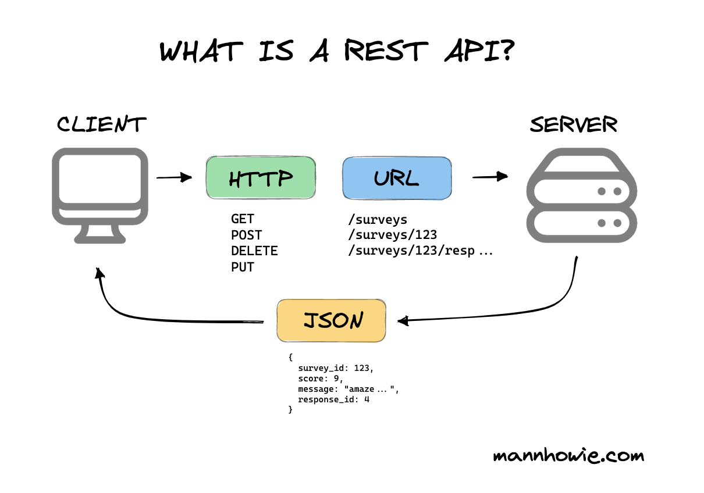

# Day.3 - Backend - RESTful API

## Recap
#### Introduction
- **Server as a Program**: Brief explanation of servers, services, and daemons.
- **Request-Response Cycle**: Overview of the basic concept.

#### Basic HTTP Server with Express
- **Setup**: Creating a basic HTTP server with Express using:
  ```js  
    // Import the express module
    const express = require('express');

    // Create an instance of an Express application
    const app = express();

    // Define a port to listen on
    const PORT = 3000 || process.env.PORT;

    // Define a basic route
    app.use((req, res) => {
        res.send('Hello world!');
    });

    // Start the server and listen on the defined port
    app.listen(PORT, () => {
    console.log(`Server is running on http://localhost:${port}`);
    });
  ```

#### Data Handling with Express
- **GET Handler**: Creating a GET endpoint with `app.get(<path>, <func>)`.
- **POST Handler**: Creating a POST endpoint with `app.post(<path>, <func>)`.

#### Making Requests
- **Using curl**: Making requests from the terminal.
    ```bash
    curl localhost:3000/
    ```

#### File I/O with Node
- **Saving Data**: Writing and reading data from non-volatile text files using Node's fs module.
- **Functions**: `fs.writeFileSync(...)` and `fs.readFileSync(...)`.


## Agenda
- What is _RESTful API_ ?
- Express and JSON
  - Making Express understand JSON
  - Targeting data based on route params
  - `PUT`, `PATCH` and `DELETE` handler
  - Responding with JSON

- Postman
  - Making request with _Postman_
  - Headers on Postman
  - Breaking and Examining `req.headers`


## Rest API
### What is an API?
- API stands for Application Programming Interface.
- It _allows different software applications to talk to each other_.
- Examples: Delivery app can use the Google Maps API to support location tracking instead of building one from scratch.



### What is a REST API?
- REST stands for _Representational State Transfer_.
- It is a _set of rules_ for building APIs.
- REST APIs use _HTTP methods_ to perform actions.

### CRUD Endpoints
- CRUD stands for Create, Read, Update, Delete.
- These are the basic operations you can perform with a REST API.
    - **Create**: Add new data (HTTP _POST_).
    - **Read**: Get data (HTTP _GET_).
    - **Update**: Change existing data (HTTP _PUT_ or _PATCH_).
    - **Delete**: Remove data (HTTP _DELETE_).

## Express and JSON
### Making Express Understand JSON
- To handle JSON data, use:
  ```js
  app.use(express.json());
  ```

### Targeting Data Based on Route Params
- Access route parameters using:
    ```js
    req.params
    ```
- **Example**: For the route `/user/:id`, `req.params.id` will give the user ID.

### PUT Handler
- Use `app.put(<path>, <func>)` to update data _completely_.
- Example:
  ```js
  app.put('/user/:id', (req, res)=>{
    // update user with id from req.params.id
  })
  ```

### PATCH Handler
- Use `app.patch(<path>, <func>)` to update data _partially_.
- Example:
  ```js
  app.patch('/user/:id', (req, res) => {
    // partially update user with id from req.params.id
  });
  ```

### DELETE Handler
- Use `app.delete(<path>, <func>)` to delete data.
- Example:
  ```js
  app.delete('/user/:id', (req, res)=>{
    // delete user with id from req.params.id
  })
  ```


### Responding with JSON
- Send JSON responses using:
  ```js
  res.json({key: 'value'});
  ```


## Postman
### Making Requests with Postman
- Postman is a tool to test APIs.
- You can send different types of requests(GET, POST, PUT, DELETE).
- Pay attention to headers, especially `Content-Type: application/json`.

### Debugging: Examining `req.headers`
- You can inspect request headers in your Express app using:
  ```js
  console.log(req.headers);
  ```


## References
- [Express `express.json()` middleware](https://expressjs.com/en/api.html#express.json)
- [Express methods](https://expressjs.com/en/5x/api.html#app.all)

## Exercise
- [04_be-server-user-manager](https://classroom.github.com/a/nYllP4hP)